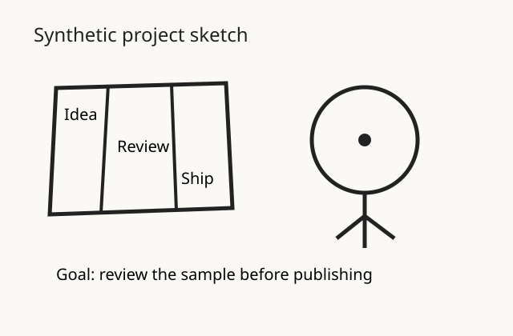
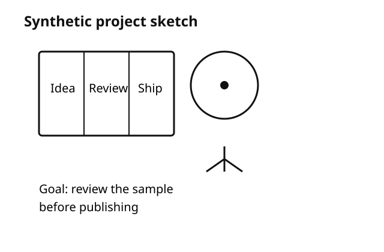
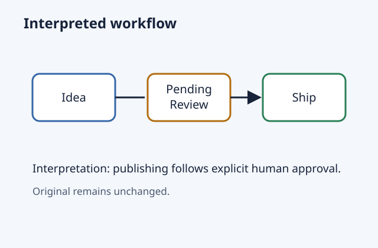

# アイノテ - AI-no-Te -

[English](README.md)

AI-no-Teは、AINOTEの手書きノートをAIで整理し、Notionで確認して、必要な結果を新しいAINOTEノートとして戻すところまでをつなぐ独立プロジェクトです。

現在のリポジトリは、一般ユーザー向けの導入ツールだけではなく、AINOTEのプロダクト・開発チーム、技術レビューを行う方、共同開発者が、目的と到達点、技術上の制約を確認できる公開記録として整理しています。

**Write freely. Organize later. — 自由に書いて、あとから整理する。**

## なぜ作ったのか

AIを使うために、人が考え方や書き方を変える必要はありません。AINOTEでは自由に考えて書き、整理はあとからAIに任せる。AI-no-Teは、その流れを試すためのプロジェクトです。

ノートは次の3つに分けて扱います。

- **Original**: AINOTEから書き出した元データ。上書きせずに残します。
- **Clean**: 意味や図、おおまかな配置を保ちながら、手書き文字を活字にした結果です。
- **Interpreted**: 同じ内容をもとに、構成や配置をより大きく整理した結果です。元にない事実は加えません。

本リポジトリの処理でOriginalを上書きすることはありません。

## 現在のワークフロー

```text
AINOTE
  -> Experimental Desktop Input（読取り専用）
  -> OCR / 文字の読取り
  -> Clean + Interpreted
  -> User Notion
  -> 例外がある場合だけ人が確認
       -> Approved
       -> Needs Review
  -> Experimental Desktop Return（明示的に実行）
  -> 新しいAINOTEノート
```

ここまでは、実際のAINOTE由来データとUser Notionを使って確認済みです。実データ、認証情報、Notionのレコード、検証用の非公開ファイルは公開対象に含めません。

現在の主な入力方法はExperimental Desktop Inputです。元ノートを変更せずに選択したページの画像を読み取り、ハッシュ情報を含むローカル処理用packageを作ります。公開されていないDesktop内部の構造に依存するため、特定のバージョンでしか動かず、更新後に使えなくなる可能性があります。

PDF Inputも削除しません。公式に案内された書き出し方法を使いたい場合や、Desktop Inputが動かない場合のfallback、互換性確認、トラブル調査に使えます。どちらから始めても、その後は同じOCR、Clean、Interpreted、Notion、Returnの流れへ進みます。

公開版には、画像を含む新しいAINOTEノートを作るExperimental Desktop Returnを含めます。公式に公開されたOpenModelの画像経路は引き続き未確認です。Experimental経路はそれとは別で、公開されていないDesktopの動作を使い、明示的に実行した場合だけ動きます。

## 現在の状況

| 機能 | 状況 |
|---|---|
| Experimental Desktopからの直接入力 | 公開CLIから利用可能。読取り専用で、Desktopのバージョンに依存 |
| AINOTEから書き出した実PDFの入力 | AINOTE Air 2で確認済み |
| PDFページの確認と300 DPIのPNG化 | 確認済み |
| OCR / 文字の読取り | 人が操作をつなぐ方式で確認済み |
| Cleanの生成 | 確認済み |
| Interpretedの生成 | 確認済み |
| User Notionの流れ | 実環境で確認済み |
| 例外がある場合だけ人が確認する運用 | 実環境で確認済み |
| 公式経路でのAINOTEテキストノート作成・読戻し | 実環境で確認済み |
| 公式経路でのAINOTE画像返却 | **保留** — 現在確認できる公開手段なし |
| Experimental Desktop画像返却 | 公開CLIから利用可能。Desktop内部の動作を使って確認済み |

## 基本方針

- Originalとハッシュのつながりを残します。
- CleanとInterpretedの役割を分けます。
- 通常の処理は自動でApprovedにし、明らかな例外だけ人が確認します。
- 公開する表示や記録に、認証情報、非公開の識別情報、実際のノート内容を含めません。
- 必要な機能を公式に公開された方法で実現できる場合は、その経路を優先します。Desktop内部の経路を使う機能にはExperimentalと明記します。

## Notionでの確認

通常ユーザー向けの構成は次のとおりです。

```text
AI-no-Te
└─ AI-no-Te Imports
```

項目は6つだけです。

| 項目 | 内容 |
|---|---|
| Title | ノート名 |
| Original | Desktop入力のsource manifestまたは元PDFと、選択したページ画像 |
| Clean | 配置変更を最小限にした活字化結果 |
| Interpreted | 構成をより大きく整理した活字化結果 |
| Return target | Use Default、Clean、Interpreted |
| Review state | Pending Review、Approved、Needs Review |

OCR、配置、生成元、プロンプト、モデル、ハッシュ、失敗履歴などの開発用情報は、Userデータベースへ出しません。詳しくは[Notionプロファイル](docs/notion-profiles.md)を参照してください。

### 例外がある場合だけ人が確認する

この方針を初めて説明するときはHuman-on-exceptionと呼んでいます。`Pending Review`は、処理中または判定前だけ使う一時状態です。処理が終わったUserレコードは、次の5つに当てはまらなければ`Approved`になります。

1. OCR結果に明らかな異常がある
2. 必要なファイルがない
3. 状態が矛盾している
4. 現在使う成果物の生成に失敗している
5. 返す内容を決められない

例外があれば`Needs Review`になり、人が確認します。重み付きスコア、総合点、細かな信頼度判定は使いません。返す内容の選択と確認結果は別に扱います。

## AINOTEへ戻す処理

### 公式経路

AINOTEの公式Skillの資料と実機確認で、次の動作を確認しています。

- 新しいノートの作成
- フォルダの作成
- Markdown／テキスト内容の作成
- ノート内容の読戻し
- 書込み後に必要な場合の公式同期処理

[公式Skill Return adapter](docs/official-skill-return.md)は現在プレビュー専用です。次の公開OpenModel経路を使い、新しいノートを作る計画を表示します。

- `POST /open-model-note/file/create`
- `GET /open-model-note/file/content`

現在のUser項目をそのまま受け取り、`Use Default -> Clean`を解決します。Originalを更新・削除・上書きする処理はありません。

Markdown画像の実機確認では、HTTPS、data URI、ローカルパス、`file://`の記法が文字列として保存されることを確認しました。ただし、AINOTEの画面ではいずれも画像として表示されませんでした。公開資料で確認できる画像挿入、添付、ファイル送信の経路も見つかっていません。このため、公式経路での画像返却はいったん保留しています。

### Experimental Desktop Return

公開CLIの`return desktop-preview`と`return desktop-execute`から利用できます。現在のUser項目をそのまま読み、`Use Default -> Clean`を解決します。Approvedで状態に矛盾がなく、選択したPNGを確認できる場合だけ実行できます。返却先は必ず新しいノートで、Originalを更新・削除・上書きしません。

この機能は公開された公式OpenModel APIではありません。公開されていないAINOTE Desktopの通信先を使うため、特定のバージョンに依存し、公式のサポート対象外です。AINOTEの更新後に動かなくなる可能性があり、互換性は保証されません。必要な補助スクリプトはインストール済みAINOTE Skillから検出し、リポジトリや配布ZIPには同梱しません。

従来の`experimental/ainote-return/`はPoCと互換性確認用の資料として残します。一般ユーザー向けruntimeは[src/ainote/desktop-return.mjs](src/ainote/desktop-return.mjs)です。AINOTEチームからcommunity projectとして調査・共有を続けてよいとの説明を受け、このExperimental経路を利用可能にしました。公認、提携、公式APIを示すものではありません。

### 公式経路とExperimental経路

画像を扱える公式経路はまだ確認できていないため、公式OpenModelでの画像返却は保留のままです。互換性上の制限を理解したユーザーはExperimental Desktop Returnを選べます。将来、公式の画像挿入・添付経路が公開された場合は、Original／Clean／Interpretedの選択やNotionの確認方法を変えずに通信部分を差し替えられます。

テキストノートを作れることは大切な確認結果ですが、選択したClean／Interpreted画像を戻せないため、AI-no-Teの一連の流れが完成したとは扱いません。

## 公開リポジトリに含むもの

- 一般ユーザー向けExperimental Desktop Input runtimeとページ／ハッシュ記録
- PDF Input Adapterとハッシュ記録
- 人が操作をつなぐOCR／Clean／Interpreted処理
- User／Development用Notion項目定義とoffline preview
- 5条件だけを使う自動確認
- 公式テキストノート作成のpreview adapter
- 一般ユーザー向けExperimental Desktop Return runtimeとoffline preview
- 架空データを使うデモと検証
- 過去PoCと互換性確認用の資料

公開されているNotion向けコマンドはプレビュー専用で、`--execute`を拒否します。User Notionの実際の流れは手元の非公開環境で確認済みですが、認証情報、送信用の手元のスクリプト、実レコード、実データは公開候補に含めません。

公開候補は`public-files.json`の`PUBLIC`一覧で決まります。分類は[公開範囲の説明](docs/public-boundary.md)を参照してください。

## デモと確認用データ

外部へ接続しないデモを実行できます。

```console
npm run demo
```

| Original | Clean | Interpreted |
|---|---|---|
|  |  |  |

Cleanの[調整前](fixtures/public-alpha-v0.1/clean-before.svg)と[調整後](fixtures/public-alpha-v0.1/clean.svg)も比較できます。いずれも、このリポジトリ用に作った架空データです。

コマンド、安全上の注意、現在確認済みの流れと公開previewの違いは、[Getting Startedガイド](docs/getting-started.ja.md)にまとめています。

## インストールと検証

必要な環境:

- Node.js 20以上
- Windows 10/11、macOS、Linux

```console
npm install --ignore-scripts
npm run demo
npm test
npm run validate:public
```

実行時に使う外部npmパッケージはありません。PDF入力には、別途Popplerの`pdfinfo`と`pdftoppm`が必要です。Popplerは同梱せず、自動インストールも行いません。

## PDF入力

PDF Inputは、Experimental Desktop Inputを利用できない場合や互換性を確認するときのfallbackです。主経路の手順は[Experimental Desktop Input](docs/experimental-desktop-input.md)を参照してください。

AINOTEからPDFを手動で書き出し、内容を確認してからページを選びます。

```console
node src/cli.mjs pdf inspect --input "note.pdf"
node src/cli.mjs pdf render --input "note.pdf" --pages 2
```

Popplerを使い、ページ順と縦横比を保ったまま300 DPIのPNGにします。新しい非公開の保存先には、内容を変えていない`original.pdf`、選択したページPNG、PDF／PNGのハッシュを持つ`metadata.json`を保存します。Originalは上書きしません。詳しくは[PDF入力の手順](docs/getting-started.ja.md#pdf-input)を参照してください。

## AI処理とNotionプレビュー

処理用CLIは、人が読み取ったOCR JSONを取り込み、版付きのClean／Interpretedプロンプトを準備し、試行結果を記録して、採用する画像を確定します。CLIが単独でAIを呼ぶものではありません。

```console
node src/cli.mjs process notion-preview --job "typed-job" --profile user
```

公開コマンドは、手元のファイル同士のつながりを検証して、外部へ書き込まない計画を表示します。Notionへ送信せず、`--execute`は拒否します。[AI処理の手順](docs/ai-processing.md)と[Notion項目の説明](docs/notion-profiles.md)を参照してください。

## セキュリティとプライバシー

- 認証情報、`.env`、個人のパス、非公開の識別情報、実際のノート、運営元との非公開のやり取りはコミットしません。
- 実PDF、OCR本文、生成画像、Notionレコード、実機確認の証拠は非公開のまま扱います。
- 公開サンプルはすべて架空のデータです。
- Originalは残したままにします。
- 確認結果からAINOTE Returnを自動実行することはありません。

### Experimental AINOTE Returnを使う前に

Experimental AINOTE Returnは、公開されていないAINOTEの動作を使う実験機能です。AINOTEの更新などにより、突然動かなくなったり、想定と異なる結果になったりする可能性があります。

実際のAINOTEへ書き込む前に、必要なデータをバックアップしてください。最初は重要でないノートを使い、自分の環境で問題なく動くことを確認してください。

AI-no-Teは、AINOTE本体や端末での動作、保存データの完全性、将来の互換性を保証しません。内容を確認したうえで、各自の判断で利用してください。

実際に書き込むには、`--execute`を付ける必要があります。返却結果は新しいノートとして作り、Originalは上書きしません。詳しくは[Experimental AINOTE Return](docs/experimental-ainote-return.md)を参照してください。

## 対応・検証環境

| 項目 | 現在確認している範囲 |
|---|---|
| 公開されているlocal tools | Windows 10/11、macOS、Linux |
| Node.js | 20以上 |
| Notion API設定 | `2026-03-11` |
| AINOTE端末 | AINOTE Air 2で確認。他の機種では未確認 |
| 公式OpenModelの実機確認 | ノート作成・読戻しを確認。画像用の公開経路は未確認 |
| Experimental wrapper | Windows 10/11。対応するDesktop／補助スクリプトの正確なバージョンは公開記録では未確定 |

## 既知の制限

- 公開リポジトリは技術検証中のPublic Alphaであり、本番サービスや互換性保証ではありません。
- OCRと画像生成は人が操作をつなぐ方式で、結果は毎回同じとは限りません。
- User Notionの流れは実環境で確認済みですが、公開Notion bridgeはプレビュー専用です。
- Markdown画像が表示されず、公開された画像用経路も確認できないため、公式経路での画像返却は保留しています。
- Experimental Desktop Returnは利用できますが、公開されていない動作と特定バージョンに依存し、公式サポートや互換性保証はありません。

## 独立性

AI-no-Teは独立した実験プロジェクトです。AINOTE、iFLYTEK、Notionの公式製品ではなく、各社による公認、提携、保守、サポートを示すものではありません。

## 今後

- Originalを残す方針とUser向け6項目を維持する。
- 通常の自動確認は、5つの例外だけを対象にする。
- 画像を扱える公式経路が公開された場合は、Experimental Desktop transportを差し替える。
- Experimental Returnを明示実行・新規ノート作成に限定し、公式adapterと分けて維持する。
- 実ノートや識別情報を公開せず、再現できる技術記録を増やす。

## ライセンス

本リポジトリで作成したコードと文書はMIT Licenseで提供します。架空のサンプルデータには、`metadata.json`に記載したCC0-1.0が適用されます。外部helperのライセンスや再配布権を本プロジェクトが主張するものではありません。
